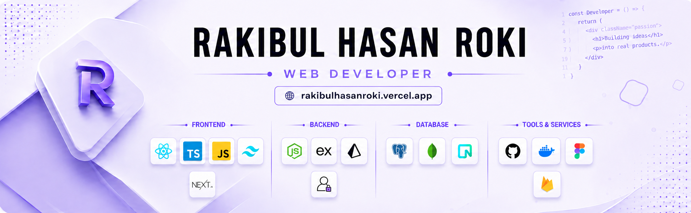

## Hi, I'm Rakibul Hasan Roki

Web Developer focused on building scalable, production-ready web applications with clean, efficient user interfaces.

- Designing and developing RESTful APIs
- Authentication, authorization, and user management systems
- Payment system integration (Stripe or similar)
- Responsive, accessible UI implementation
- Database design, optimization, and querying

Focused on product-driven development and building reliable, maintainable systems in collaborative environments.

## Tech Stack

<strong>Frontend</strong>
 

<strong>Backend</strong>
 

<strong>DevOps & Tools</strong>
 

## Currently Learning

- Docker for containerized application deployment
- Environment management and production configuration best practices
- CI/CD pipelines for automated build and deployment

## GitHub Stats

  
  

<picture>
  <source media="(prefers-color-scheme: dark)" srcset="https://raw.githubusercontent.com/rakibulhasanroki/rakibulhasanroki/output/github-snake-dark.svg" />
  <source media="(prefers-color-scheme: light)" srcset="https://raw.githubusercontent.com/rakibulhasanroki/rakibulhasanroki/output/github-snake.svg" />
  
</picture>
