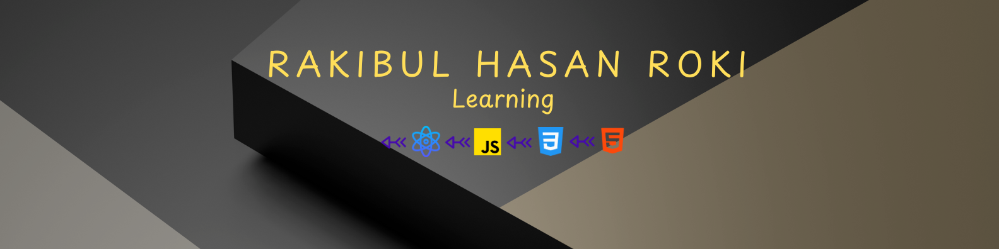

<h2 align="left">Hi 👋! My name is  Rakibul Hasan Roki 🌱 Currently Evolving Deepening my expertise in front-end development, with a focus on mastering React and advanced CSS techniques. Continuously enhancing my skills in modern tools and best practices to build high-quality, scalable web applications.</h2>

  
  
  
  
  
  
  
  
  
  
  
  
  
  
  
  
  
  
  
  
  

  
  

  
  

<picture>
  <source media="(prefers-color-scheme: dark)" srcset="https://raw.githubusercontent.com/rakibulhasanroki/rakibulhasanroki/output/github-snake-dark.svg" />
  <source media="(prefers-color-scheme: light)" srcset="https://raw.githubusercontent.com/rakibulhasanroki/rakibulhasanroki/output/github-snake.svg" />
  
</picture>
